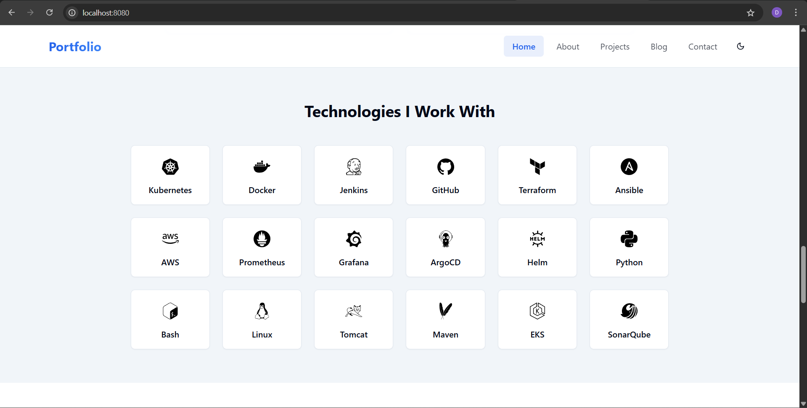

<div align="center">

# **DevOps Portfolio Website**

[](https://reactjs.org/)
[](https://www.typescriptlang.org/)
[](https://vitejs.dev/)
[](https://tailwindcss.com/)
[](https://ui.shadcn.com/)
[](https://www.framer.com/motion/)
[](https://reactrouter.com/)
[](https://react-hook-form.com/)
[](https://github.com/colinhacks/zod)
[](https://tanstack.com/query/latest)
[](https://lucide.dev/)

</div>

---



## 📋 Features

- **Responsive Design** — Looks great on all devices
- **Modern UI** — Built with Tailwind CSS and shadcn/ui components
- **Dark/Light Mode** — Theme switching support powered by [Tailwind CSS](https://tailwindcss.com/)
- **Animated Page Transitions** — Powered by [Framer Motion](https://www.framer.com/motion/)
- **Multiple Pages** — Home, About, Projects, Blog, and Contact sections
- **DevOps Focus** — Content tailored for DevOps engineers
- **Interactive Components** — Progress bars, cards, and more
- **Form Validation** — Using [React Hook Form](https://react-hook-form.com/) and [Zod](https://github.com/colinhacks/zod)

## 🚀 Quick Start

### Prerequisites

- [Node.js](https://nodejs.org/) (v18 or newer)
- npm or yarn package manager

### Installation

```bash
git clone https://github.com/yourusername/devops-portfolio.git
cd devops-portfolio
npm install
npm run dev
```

Open your browser and visit: `http://localhost:8080`

## 🖌️ Customization

### Personal Information

Edit data files inside `src/data/` to update your portfolio:

- `projects.ts`: Portfolio projects
- `skills.ts`: Technical skills
- `blog.ts`: Blog posts

### Colors and Styling

- Modify color scheme in `src/styles/global.css`
- Adjust Tailwind config in `tailwind.config.ts`

### Adding New Pages

- Create new component in `src/pages/`
- Add route in `src/App.tsx`

## 📦 Building for Production

```bash
npm run build
```

The production build outputs to the `dist/` directory.

## 🔍 Preview Production Build

```bash
npm run preview
```

## 🛠️ Technologies Used

| Technology      | Description                         |
| --------------- | --------------------------------- |
| React           | Library for building UI            |
| TypeScript      | Typed JavaScript                   |
| Vite            | Next-gen frontend tooling          |
| Tailwind CSS    | Utility-first CSS framework        |
| shadcn/ui       | Modern Radix-based UI components   |
| Framer Motion   | Animation library                  |
| React Router    | SPA routing                       |
| React Hook Form | Form validation                   |
| Zod             | Schema validation                 |
| TanStack Query  | Data fetching and caching          |
| Lucide Icons    | Icon library                      |

---

## 📄 License

Distributed under the MIT License. See `LICENSE` for more information.

---

Feel free to ask if you want me to add badges for Docker, Jenkins, Kubernetes, SonarQube, or Nexus, or containerization/DevOps tools you are using!

---

**This README structure and badges make your project easy to understand and visually appealing for DevOps professionals reviewing your portfolio.**
